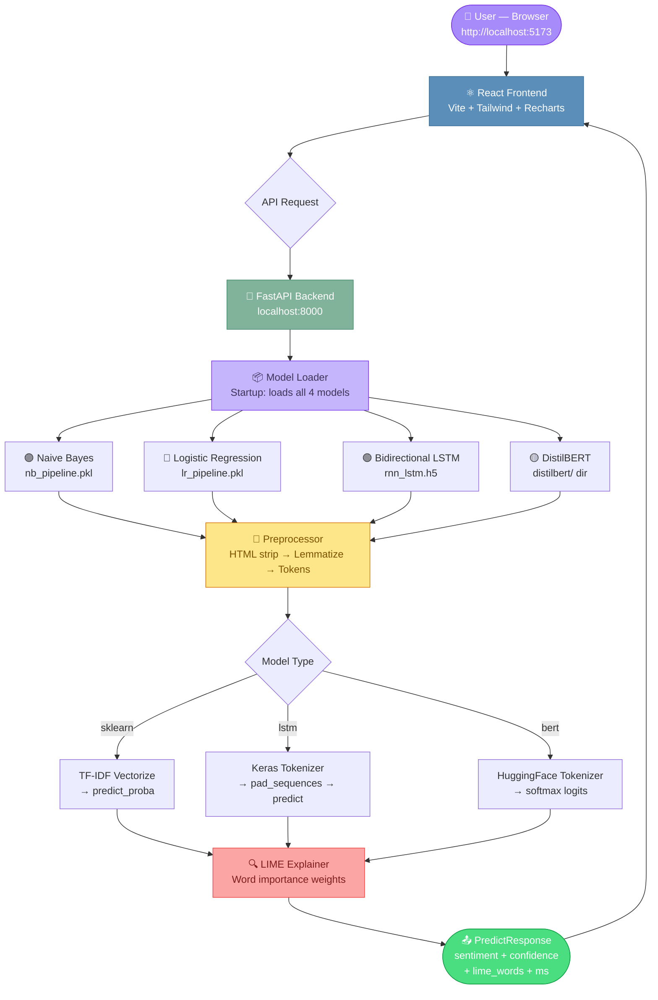
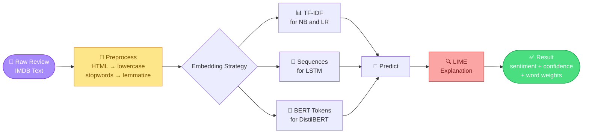

# 🎬 SentimentAI — Movie Review Analysis Dashboard

> **End-to-end NLP pipeline exploring sentiment classification from Bag-of-Words to BERT** ✨

A full-stack ML dashboard for IMDB movie sentiment analysis, featuring 4 models (Naive Bayes, Logistic Regression, Bidirectional LSTM, DistilBERT), live predictions with LIME explanations, and rich data visualizations — all powered by a FastAPI backend and a beautiful React frontend.

---

## ✨ Features

| Feature | Description |
|---|---|
| 🧠 **4 ML Models** | Naive Bayes, Logistic Regression, Bidirectional LSTM, DistilBERT |
| ⚡ **Live Predictor** | Real-time sentiment analysis with confidence gauge |
| 🔍 **LIME Explanations** | Word-level importance highlighting for every prediction |
| 📊 **Model Comparison** | Metrics table, ROC curves, radar chart, confusion matrices |
| 📈 **Data Explorer** | Length histograms, sentiment donut, word frequency charts |
| 🐛 **Error Analysis** | Filterable misclassification table with sarcasm examples |
| 🎓 **Demo Mode** | Keyword heuristics — works without any trained models |
| 🌙 **Beautiful UI** | Warm design system with Framer Motion animations |

---

## 🗺️ Architecture Overview



---

## 🔁 ML Pipeline Flow



---

## 🚀 Quick Start

### Prerequisites

- **Python** 3.9+
- **Node.js** v18+

---

### 1. Clone the repository

```bash
git clone https://github.com/your-username/sentiment-dashboard.git
cd sentiment-dashboard
```

---

### 2. Backend Setup

```bash
cd backend
python -m venv venv

# Windows
venv\Scripts\activate

# macOS / Linux
source venv/bin/activate

pip install -r requirements.txt
```

Download required NLTK data:

```bash
python -c "import nltk; nltk.download('stopwords'); nltk.download('wordnet'); nltk.download('omw-1.4')"
```

Start the API:

```bash
uvicorn main:app --reload --port 8000
```

Backend starts at → **http://localhost:8000**
Swagger docs at → **http://localhost:8000/docs**

> **Note:** Without saved model files in `backend/models/saved/`, the backend runs in **demo mode** using keyword heuristics. This still lets you test the full UI with realistic-looking results.

---

### 3. Frontend Setup

Open a new terminal:

```bash
cd frontend
npm install
npm run dev
```

Frontend starts at → **http://localhost:5173**

---

## 🔗 Connecting Real Trained Models

After running your `sentiment_analysis.py` training script, save your models using the helper:

```python
# Add to the end of sentiment_analysis.py
import sys
sys.path.insert(0, '.')
from save_models import save_sklearn, save_lstm, save_distilbert, save_keras_tokenizer

save_sklearn(nb_pipeline, 'naive_bayes_pipeline')
save_sklearn(best_lr_model, 'logistic_regression_pipeline')
save_keras_tokenizer(tokenizer)
save_lstm(rnn_model)
save_distilbert(model_bert, tokenizer_bert)
```

For TensorFlow / Transformers support, uncomment in `backend/requirements.txt`:

```
tensorflow==2.15.0
transformers==4.36.2
```

### Model File Locations

| Model | File(s) | Path |
|---|---|---|
| Naive Bayes | `naive_bayes_pipeline.pkl` | `backend/models/saved/` |
| Logistic Regression | `logistic_regression_pipeline.pkl` | `backend/models/saved/` |
| LSTM | `rnn_lstm.h5` + `tokenizer.pkl` | `backend/models/saved/` |
| DistilBERT | entire directory | `backend/models/saved/distilbert/` |

---

## 📁 Project Structure

```
sentiment-dashboard/
├── backend/
│   ├── main.py                  # FastAPI app + all API routes
│   ├── schemas.py               # Pydantic request/response models
│   ├── requirements.txt         # Python dependencies
│   ├── models/
│   │   ├── loader.py            # Loads all 4 models on startup
│   │   └── saved/               # Place .pkl / .h5 / distilbert/ files here
│   └── services/
│       ├── preprocess.py        # Text cleaning pipeline (HTML → lemmatize)
│       ├── predict.py           # Inference logic for all model types
│       └── explain.py           # LIME explanation generation
│
├── frontend/
│   └── src/
│       ├── pages/
│       │   ├── Home.jsx             # Hero, stat cards, pipeline diagram
│       │   ├── DataExplorer.jsx     # Charts + paginated review table
│       │   ├── LivePredictor.jsx    # Textarea → model → confidence gauge
│       │   ├── ModelComparison.jsx  # Metrics, ROC, radar, confusion matrix
│       │   └── ErrorAnalysis.jsx    # Filterable misclassification table
│       ├── components/
│       │   ├── Navbar.jsx
│       │   ├── StatCard.jsx
│       │   ├── ConfidenceGauge.jsx  # SVG arc gauge
│       │   ├── LimeHighlighter.jsx  # Color-coded word importance
│       │   ├── ModelSelector.jsx    # Multi-model toggle
│       │   └── charts/
│       │       ├── MetricsBar.jsx
│       │       ├── ROCCurve.jsx
│       │       ├── RadarChart.jsx
│       │       └── ConfusionMatrix.jsx
│       ├── hooks/
│       │   └── usePrediction.js     # Custom hook for API calls + state
│       └── services/
│           └── api.js               # Axios client (VITE_API_URL)
│
├── save_models.py               # Helper to export trained models for the API
└── sentiment_analysis.py        # Original training script
```

---

## 📡 API Reference

### Prediction

| Method | Endpoint | Description |
|---|---|---|
| `POST` | `/predict` | Single model prediction + LIME explanation |
| `POST` | `/predict/compare` | Run all 4 models on the same input |

**Example request:**

```bash
curl -X POST http://localhost:8000/predict \
  -H "Content-Type: application/json" \
  -d '{"text": "This movie was absolutely fantastic!", "model": "logistic_regression"}'
```

**Example response:**

```json
{
  "model": "logistic_regression",
  "sentiment": "positive",
  "confidence": 0.9312,
  "lime_words": [
    { "word": "fantastic", "weight": 0.8421 },
    { "word": "absolutely", "weight": 0.3109 }
  ],
  "inference_time_ms": 12.4
}
```

### Analytics & Data

| Method | Endpoint | Description |
|---|---|---|
| `GET` | `/metrics` | Pre-computed test set metrics for all 4 models |
| `GET` | `/dataset/stats` | EDA data (lengths, word freqs, sample reviews) |
| `GET` | `/errors` | Misclassifications — filterable by `model`, `true_label`, `pred_label` |
| `GET` | `/training-history` | Loss/accuracy per epoch (`?model=rnn_lstm` or `distilbert`) |
| `GET` | `/` | Health check |

---

## 🎨 Pages

| Page | Route | What's Inside |
|---|---|---|
| **Home** | `/` | Hero, stat cards, pipeline diagram, tech stack grid |
| **Data Explorer** | `/data` | Length histograms, sentiment donut, word frequency bars, paginated review table |
| **Live Predictor** | `/predictor` | Textarea input, model selector, confidence gauge, LIME word highlighting |
| **Model Comparison** | `/comparison` | Metrics table, grouped bars, ROC curves, radar chart, confusion matrices, training history |
| **Error Analysis** | `/errors` | Filterable misclassification table, high-confidence failures, error-by-length chart, sarcasm examples |

---

## 📊 Model Performance

| Model | Accuracy | Precision | Recall | F1-Score | AUC-ROC |
|---|---|---|---|---|---|
| 🟣 **Naive Bayes** | 87.2% | 87.6% | 86.7% | 87.1% | 0.950 |
| 🔵 **Logistic Regression** | 90.4% | 91.0% | 89.7% | 90.3% | 0.967 |
| 🟢 **RNN (LSTM)** | 91.2% | 91.8% | 90.5% | 91.1% | 0.972 |
| 🟡 **DistilBERT** ⭐ | **93.2%** | **93.5%** | **92.8%** | **93.1%** | **0.986** |

---

## 🛠️ Tech Stack

**Frontend**

| Technology | Purpose |
|---|---|
| React 18 + Vite | UI framework + fast dev server |
| Tailwind CSS | Utility-first styling with custom warm palette |
| Recharts | Line, bar, pie, radar chart components |
| Framer Motion | Smooth page and element animations |
| React Router v6 | Client-side routing |
| Axios | HTTP client with base URL config |
| react-hot-toast | Non-intrusive notification toasts |
| lucide-react | Clean icon set |

**Backend**

| Technology | Purpose |
|---|---|
| FastAPI | Async Python API framework |
| Pydantic v2 | Request/response schema validation |
| uvicorn | ASGI server |
| scikit-learn | Naive Bayes + Logistic Regression pipelines |
| TensorFlow/Keras | Bidirectional LSTM model |
| HuggingFace Transformers | DistilBERT fine-tuning + inference |
| LIME | Local Interpretable Model-agnostic Explanations |
| NLTK | Stopword removal + lemmatization |

---

## ⚙️ Environment Variables

**Frontend** — create `frontend/.env`:

```env
VITE_API_URL=http://localhost:8000
```

For production, point this to your deployed backend URL.

---

## 🚢 Deployment

### Backend (e.g. Render)

1. Set all Python environment variables in your host dashboard
2. Install command: `pip install -r requirements.txt`
3. Start command: `uvicorn main:app --host 0.0.0.0 --port $PORT`
4. For TF/BERT models, ensure your instance has enough RAM (≥ 4 GB recommended)

### Frontend (e.g. Vercel)

1. Set `VITE_API_URL` to your deployed backend URL (e.g. `https://your-backend.onrender.com`)
2. Build command: `npm run build`
3. Output directory: `dist`
4. Vercel auto-handles client-side routing rewrites

---

## 🐛 Known Issues / Common Gotchas

- ✅ Demo mode runs without any model files — great for UI testing
- ✅ LIME falls back to keyword heuristics for non-sklearn models (LSTM, DistilBERT)
- ⚠️ TensorFlow and Transformers are commented out in `requirements.txt` by default — uncomment to enable LSTM + DistilBERT
- ⚠️ DistilBERT requires ~1.5 GB RAM to load — demo mode is recommended for lightweight hosting
- ⚠️ LIME explanations add ~200–500ms to inference time for sklearn models

---

## 📄 License

MIT — free to use, modify, and distribute.
